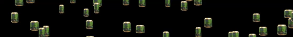

## Hello!

My name is Touko Pakarinen. I am a 2nd year CS student in the University of Eastern Finland.
Currently my main focus is in learning fullstack-web development, and improving my skills in the languages/technologies i have listed in the _skills_ section.

Here in my github you can find projects i have created as a part of my studies or in my freetime.

### Skills
         

      	

### Contact me
[][1] [][2] [][3]

[1]: https://www.linkedin.com/in/touko-pakarinen-3b13b0205/
[2]: https://t.me/toukojjouko
[3]: mailto:toukop97@gmail.com

<!--
**ToukoJouko/ToukoJouko** is a ✨ _special_ ✨ repository because its `README.md` (this file) appears on your GitHub profile.

Here are some ideas to get you started:

- 🔭 I’m currently working on ...
- 🌱 I’m currently learning ...
- 👯 I’m looking to collaborate on ...
- 🤔 I’m looking for help with ...
- 💬 Ask me about ...
- 📫 How to reach me: ...
- 😄 Pronouns: ...
- ⚡ Fun fact: ...
-->
